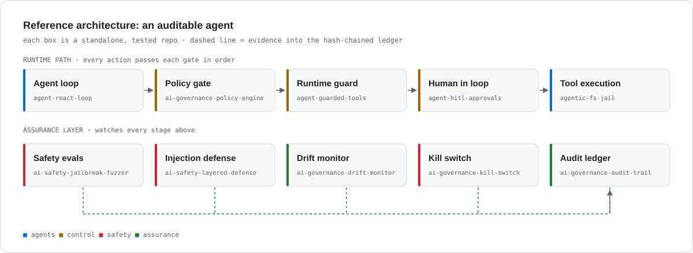

<picture>
  <source media="(prefers-color-scheme: dark)" srcset="assets/hero-dark.svg">
  
</picture>

<br>

I work where AI systems meet the controls that make them trustworthy. By day I lead technology audit innovation at a F-10 company. The rest of the time I build the tooling I wish existed: policy gates, guardrails, safety evals, and tamper-evident audit trails for LLMs and autonomous agents.

**Thesis:** an agent you can't audit is one you can't deploy. Every action should leave evidence that a regulator, an auditor, or an on-call engineer can verify afterward.

<br>

<picture>
  <source media="(prefers-color-scheme: dark)" srcset="assets/arch-dark.svg">
  
</picture>

## ⭐ Flagship projects

### [agentgate](https://github.com/ramtoo-cell/agentgate) &nbsp;[](https://github.com/ramtoo-cell/agentgate/actions/workflows/ci.yml)

**Policy, human approval, and a tamper-evident audit trail for every AI agent tool call.** Use it as a Python decorator, or as a drop-in **MCP proxy** in front of any MCP server (Claude Desktop, Cursor) with zero code changes.

- Default-deny JSON policies. Tools the agent can never use are hidden from the model entirely.
- Hash-chained, optionally HMAC-keyed audit ledger. `agentgate verify` pinpoints the first tampered line.
- Pluggable human approval (Slack, tickets, any executable), plus secret/PII redaction and rate limits.
- **~65 µs per call** after profiling-driven optimization (4× faster than v0.1). Zero dependencies, 60 tests, 95% coverage, CI on Python 3.9–3.13.
- Google-style [design doc with threat model](https://github.com/ramtoo-cell/agentgate/blob/main/docs/DESIGN.md), tested end to end against the reference MCP filesystem server.

```bash
pip install git+https://github.com/ramtoo-cell/agentgate
```

### [agent-guardian](https://github.com/ramtoo-cell/agent-guardian)

A governance sidecar for AI agents. Wrap any agent to get policy enforcement (blocklists, PII redaction, prompt-injection detection), budgets (steps, tokens, cost, latency), a tamper-evident audit log, and built-in red-team evals with a scorecard. A CLI writes a Markdown governance report.

```bash
pip install git+https://github.com/ramtoo-cell/agent-guardian
```

<br>

## Work, by layer

250+ public repositories. Each one is small, self-contained, and tested, and does one thing. **[Browse the full index →](https://github.com/ramtoo-cell/ai-portfolio-index)**

<table>
<tr>
<td width="33%" valign="top">

**🛡️ AI safety & alignment**<br>
<sub>100 repos</sub>

Red-teaming, interpretability, unlearning, watermarking, calibration.

- [jailbreak-fuzzer](https://github.com/ramtoo-cell/ai-safety-jailbreak-fuzzer)
- [layered-defense](https://github.com/ramtoo-cell/ai-safety-layered-defense)
- [tripwire-eval](https://github.com/ramtoo-cell/ai-safety-tripwire-eval)
- [circuit-graph](https://github.com/ramtoo-cell/ai-safety-circuit-graph)
- [gradient-unlearning](https://github.com/ramtoo-cell/ai-safety-gradient-unlearning)
- [watermark-greenlist](https://github.com/ramtoo-cell/ai-safety-watermark-greenlist)

</td>
<td width="33%" valign="top">

**⚖️ AI governance & audit**<br>
<sub>50 repos</sub>

Controls, evidence, regulatory mapping, incident response.

- [audit-trail](https://github.com/ramtoo-cell/ai-governance-audit-trail)
- [policy-engine](https://github.com/ramtoo-cell/ai-governance-policy-engine)
- [eu-ai-act-mapper](https://github.com/ramtoo-cell/ai-governance-eu-ai-act-mapper)
- [control-mapper](https://github.com/ramtoo-cell/ai-governance-control-mapper)
- [model-risk-register](https://github.com/ramtoo-cell/ai-governance-model-risk-register)
- [kill-switch](https://github.com/ramtoo-cell/ai-governance-kill-switch)

</td>
<td width="33%" valign="top">

**🤖 Agentic systems**<br>
<sub>100 repos</sub>

Agent loops, memory, MCP, orchestration, sandboxing, markets.

- [react-loop](https://github.com/ramtoo-cell/agent-react-loop)
- [mcp-server](https://github.com/ramtoo-cell/agent-mcp-server)
- [hitl-approvals](https://github.com/ramtoo-cell/agent-hitl-approvals)
- [fs-jail](https://github.com/ramtoo-cell/agentic-fs-jail)
- [contract-net](https://github.com/ramtoo-cell/agentic-contract-net)
- [trajectory-replayer](https://github.com/ramtoo-cell/agent-trajectory-replayer)

</td>
</tr>
</table>

## How I build

| Principle | In practice |
|---|---|
| **Evidence over assertion** | Decisions, prompts, and tool calls are hash-chained and can be replayed. If it wasn't logged, it didn't happen. |
| **Default deny** | Egress, file system, tools, and quotas start closed. Agents get capabilities one at a time, on purpose. |
| **Small, sharp primitives** | One concern per repo, standard library first, and deterministic tests. You can adopt one piece without taking all of them. |
| **Controls map to frameworks** | Every control traces to the EU AI Act, NIST AI RMF, ISO 42001, or SOC 2, so audit is a query instead of a project. |
| **Humans hold the keys** | Approval queues, escalation ladders, and a two-person kill switch. Autonomy is granted, never assumed. |

## Background

- **Education:** Chicago Booth MBA (Honors) · Purdue M.S. Artificial Intelligence *(in progress)* · CISA *(in progress)*
- **Research:** two AI patent applications pending · four published AI disclosures
- **Focus:** model risk, AI audit trails, eval harnesses, red-teaming, agent safety

<br>

<sub>Building in public. If you work on AI assurance, agent safety, or audit automation, let's talk. Open an issue on any repo.</sub>
